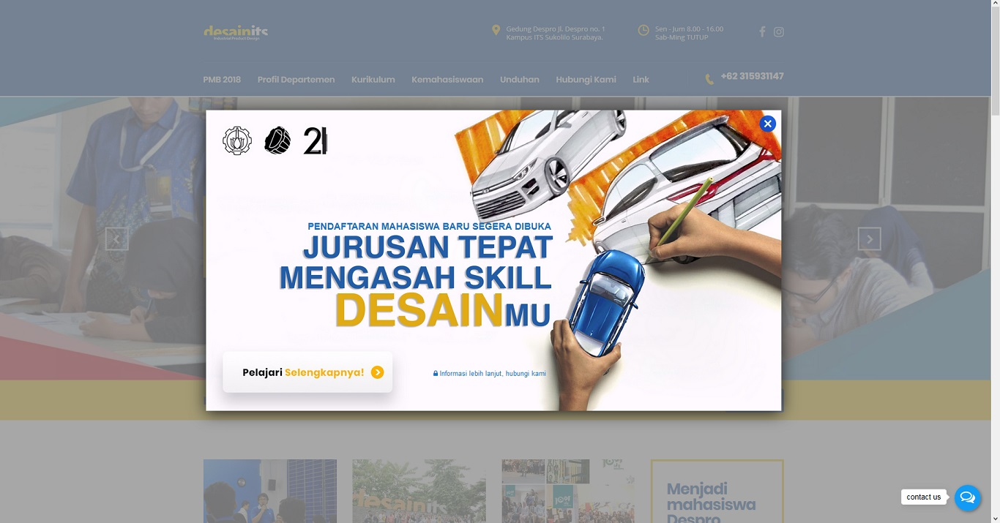
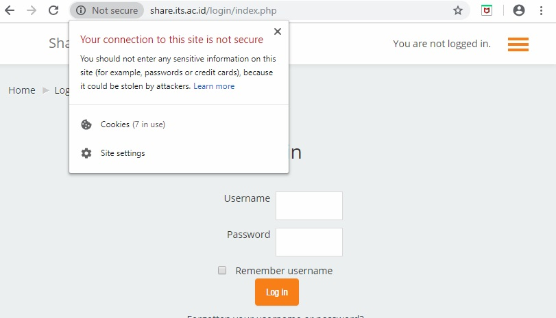
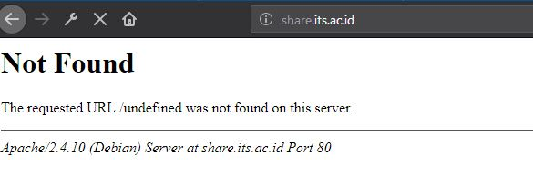
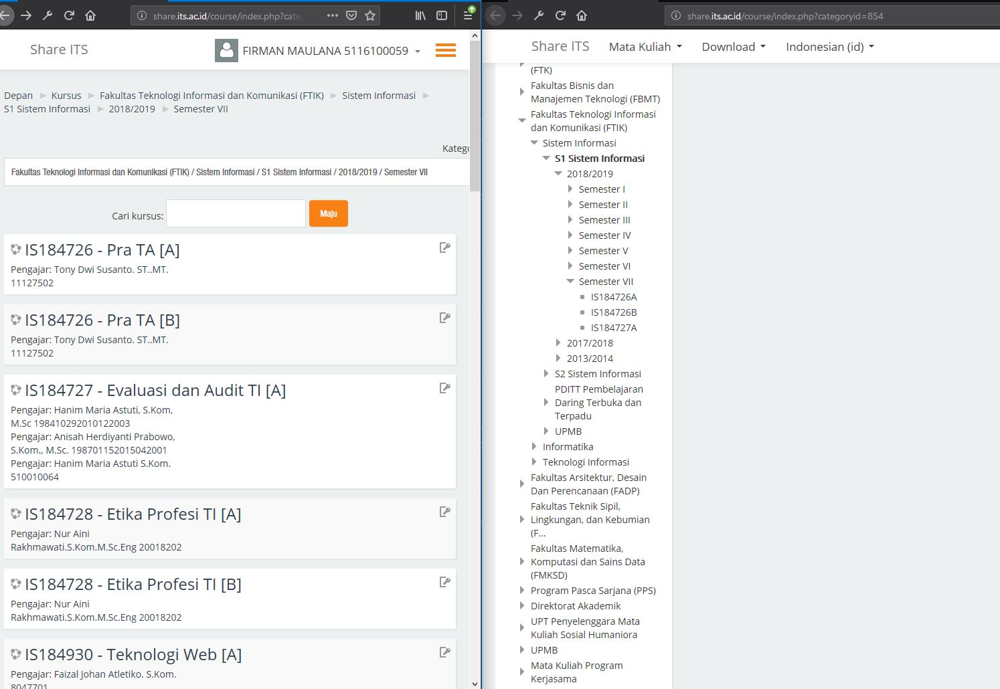
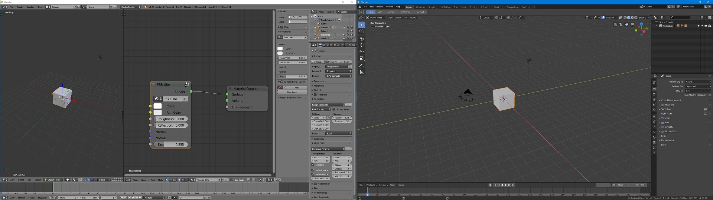

# Assignment - 0
In this assignment i'm going to analyze certain subject for any possible design flaw that i can found and provide some recommendation for it.

## Subjects
1. [ITS's Industrial Product Design Website](http://despro.its.ac.id/)
2. [ITS's Elearning Website (Share ITS)](http://share.its.ac.id/)
3. [Blender Beta 2.8's Desktop App](https://www.blender.org/2-8/)

### ITS's Industrial Product Design Website
Type  : Website
Link  : [http://despro.its.ac.id/](http://despro.its.ac.id/)
Proof : [TBA](https://youtube.com)
Flaw  : Image that looks like a button is not clickable (**Usability** and **Functional**)
Tester : **Affan Ghaffar** 

When you open this website you will be greeted by a fancy modal box and all of its animations that pop out out of nowhere. My friend's first reaction was trying to click "Pelajari Selengkapnya" which looks like a button since it has box shadow under it and an icon however he didn't know that it's just a picture that provide **no function at all**. That box shadow is actually following [Material Design's Guidelines](https://material.io/design/components/buttons.html) for buttons but didn't act like a button. 

#### Solution
My solution for this problem was to literally make that button on top of that image or completely remove that from the main image. 

### ITS's Elearning Website (Share ITS)
Type  : Website
Link  : [http://share.its.ac.id/](http://share.its.ac.id/)
Proof : [TBA](https://youtube.com)
Flaw  : Sometimes down, Risky to use, Not working as expected (**Reliability**, **Risk** and **Functional** )
Tester : **Affan Ghaffar** and **Muhajir**

First, this website is categorized as **Not Secure** but this website asks for **sensitive information** which is weird. I always got warning from my Antivirus everytime i enter my *not so secure* password in this site which is annoying but helpful. 

Sometimes the server is down which i don't know why its down in the first place. This **downtime is unpredictable** since its happen randomly like when i'm trying to visit this site to take some screenshot from it. 

After sometimes using this website, i noticed that the courses available from sidebar and main courses selection is not the same. For example i ask my friend to find "Teknologi Bergerak" course but can't find it in the course menu. I noticed that when you use sidebar for navigation it will have different URL from using course menu for navigation.

As you notice from sidebar (right) there are only 3 courses available while in the course menu (left) you can clearly see that there is atleast 6 courses available. I noticed that when you use sidebar for navigation it will **have different URL** from using course menu for navigation.

#### Solution
This website is very important for some students in ITS and must be secured at all cost. If cost is the main problem then just use free SSL like [Let's Encrypt](https://letsencrypt.org/). That downtime must be resolved since other people may use it. All courses must be consistent between sidebar and course menu. Making the Navigation URL consistent should fix this problem.

### Blender Beta 2.8
Type  : Desktop App
Link  : [https://www.blender.org/2-8/](https://www.blender.org/2-8/)
Proof : [TBA](https://youtube.com)
Flaw  : Design is changed completely yet still hard to understand (**Customer Experience**)
Tester : **Bolt**

Blender is known to be **hard to use** already, introducing a new one still didn't solve this problem. For people who already get used to how blender feels might have to **re-learn** many parts of blender that will be changed in 2.8. I ask my friend who already know how to use blender to render their scene using Blender's Cycle Render and surprisingly **he didn't even know how to render it**. The button usually sits in the render tab in right side of the screen (left image) but **now gone**. There are many shortcuts that has been changed or removed in this new version of blender. 

#### Solution
Blender should provide option to reuse old keyboard shortcut since blender user already know how to use it. Blender should also put back all button that **frequently used** in Blender 2.79 in their old position in Blender 2.8 so user can easily use it.

## Credits
Special Thanks to **Affan Ghaffar**, **Muhajir** and **Bolt** for testing my subjects.

## Reference
- [https://simplicable.com/new/design-flaw](https://simplicable.com/new/design-flaw)

